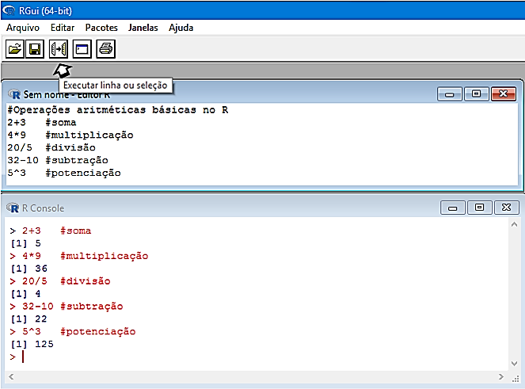
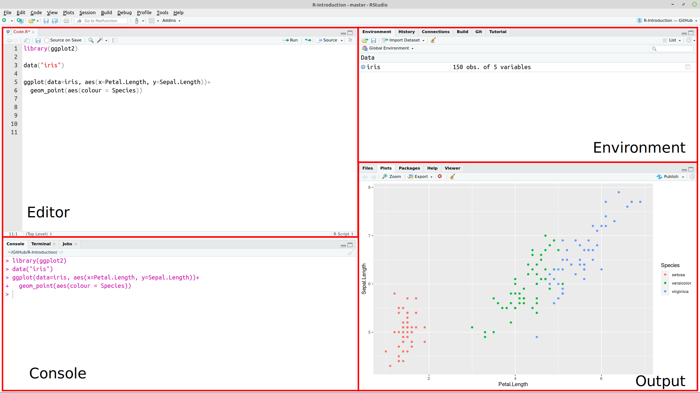
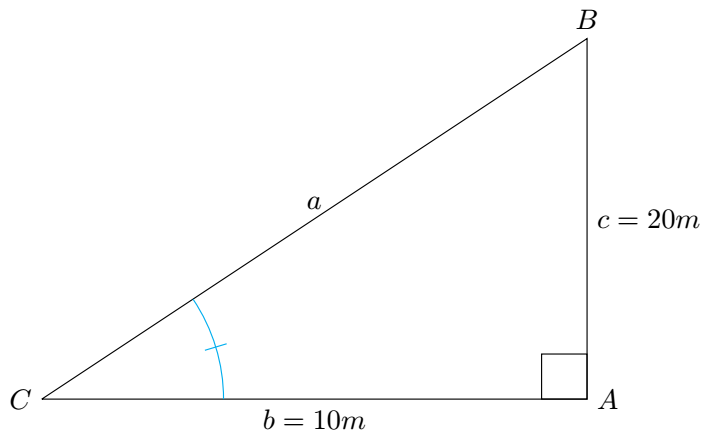
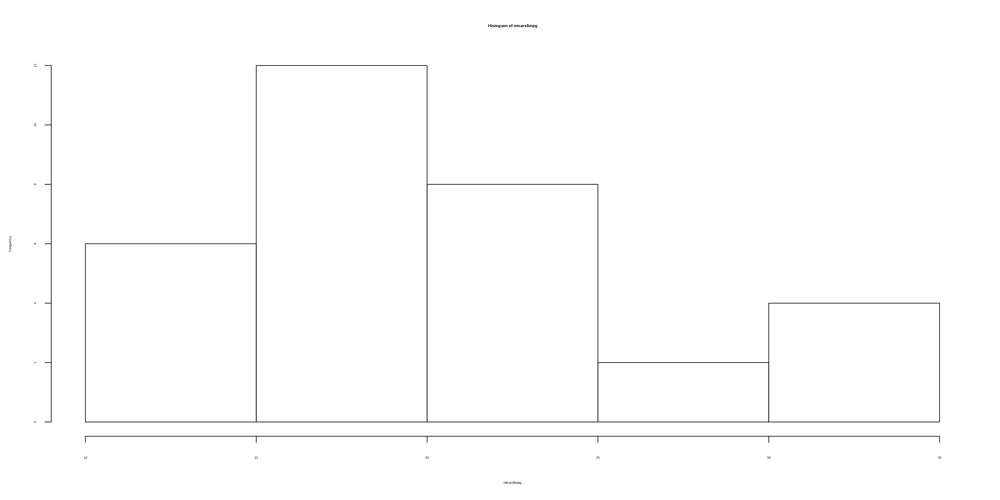

name: toc

```{r setup, include=FALSE}
options(htmltools.dir.version = FALSE)
```

```{r xaringanExtra, echo=FALSE}
library(xaringanExtra)
use_logo(
  image_url = "fig/ufpa.png",
  position = css_position(top = ".8em", right = "1em"),
  width = "140px",
  height = "140px"
)

use_extra_styles(
  hover_code_line = TRUE,         #<<
  mute_unhighlighted_code = TRUE  #<<
)

use_tachyons()
use_panelset()
use_clipboard()
style_panelset(panel_tab_color_active = "red")
```

```{r xaringanthemer, warning=FALSE, include=FALSE}
library(xaringanthemer)
style_mono_accent(
  base_color = "#43418A",
  header_font_google = google_font("Josefin Sans"),
  text_font_google   = google_font("Montserrat", "300", "300i"),
  code_font_google   = google_font("Fira Mono")
)
```

# 👋 Olá, sejam bem vindos!

## <bdi style="color:magenta;">1. Sobre o instrutor</bdi>

.pull-left[
* <bdi style="font-weight:bold">Graduação (Titulação: ano 2008)</bdi>
    + Universidade Federal Rural da Amazônia (UFRA); e
    + Título: Bacharel em Engenharia Florestal.

* <bdi style="font-weight:bold">Mestrado (Titulação: ano 2011)</bdi>
    + Universidade Federal Rural da Amazônia (UFRA);
    + Programa de Pós-graduação em Ciências Florestais (PPGCF); e
    + Área de Concentração: Manejo de ecossistemas florestais.
]

.pull-right[
* <bdi style="font-weight:bold">Doutorado (Titulação: ano 2020)</bdi>
    + Universidade Federal do Paraná (UFPR);
    + Programa de Pós-graduação em Engenharia Florestal (PPGEF); e
    + Área de Concentração: Manejo Florestal.
    
* <bdi style="font-weight:bold">Especialização (Defesa: ano 2019)</bdi>
    + Universidade Federal do Paraná (UFPR);
    + Área: Big Data e Data Science
]

---
# 👋 Olá, sejam bem vindos!

.pull-left[
## <bdi style="color:magenta;">2. Interesses atuais</bdi>

* <bdi style="font-weight:bold">Linguagem de programação</bdi>
    + R
    + Python
    
* <bdi style="font-weight:bold">Modelagem preditiva aplicada à ciência florestal</bdi>
    + Aprendizado de máquina
    
* <bdi style="font-weight:bold">Visão computacional</bdi> 
    + reconhecimento de imagens
    
* <bdi style="font-weight:bold">Criação de Dashboard - Shiny</bdi>
]

.pull-right[
## <bdi style="color:magenta;">3. Websites e contatos </bdi>

<html>
<head>
<link rel="stylesheet" href="https://maxcdn.bootstrapcdn.com/font-awesome/4.4.0/css/font-awesome.min.css">
</head>
<body>
<i class="fa fa-github fa-2x"></i>
<!--use the fa-lg (33% increase), fa-2x, fa-3x, fa-4x, or fa-5x classes-->
</body>
</html>
<bdi style="font-weight:bold">GitHub:</bdi> https://github.com/DeivisonSouza

<span class="iconify" data-icon="fa-brands:orcid" data-inline="false"></span>


<div itemscope itemtype="https://schema.org/Person"><a itemprop="sameAs" content="https://orcid.org/0000-0002-2975-0927" href="https://orcid.org/0000-0002-2975-0927" target="orcid.widget" rel="me noopener noreferrer" style="vertical-align:top;">https://orcid.org/0000-0002-2975-0927</a></div>

```{r, echo=FALSE, out.width='20%', fig.align='center', fig.cap=''}
knitr::include_graphics('fig/ORCID.png')
```

Email: deivisonvs@ufpa.br
]

---
# Conteúdo

.pull-left[
<p style="font-weight:bold;"> Parte 1 - Motivação </p>
* [A linguagem R](#linguagemR)
* [Por que usar a linguagem R?](#porqueR)
]

.pull-right[
<p style="font-weight:bold;"> Parte 2 - RGui e RStudio  </p>
* [RGui](#RGui)
    + [Download e instalação](#RGui)
    + [Contato inicial](#RguiInicial)
* [IDE RStudio](#Rstudio)
    + [Download e instalação](#Rstudio)
    + [Painéis principais](#IDEPaineis)
* [Como fazer citações?](#ComoCitar)
]

<p style="font-weight:bold;"> Parte 3 - Iniciando na linguagem R </p>
- [Operadores no R](#Operadores)
    + [Aritméticos](#arit)
    + [Relacionais](#relac)
    + [Lógicos](#log)
- [Funções matemáticas usuais](#FunsMat)

---
name: linguagemR

# Linguagem de Programação R

## Um software estatístico livre

.bg-washed-near-white.b--dark-green.ba.bw2.br3.shadow-5.ph4.mt5[
R é um ambiente de software livre de estatística e gráficos, capaz de compilar e executar em uma ampla variedade de plataformas UNIX, Windows e MacOS. Para fazer o download do R, é necessário escolher um **espelho CRAN** (https://cran.r-project.org/) para que seja feito o download da versão mais atual.
]
--

.bg-washed-near-white.b--dark-green.ba.bw2.br3.shadow-5.ph4.mt5[
.center[<bdi style="font-weight:bold">Espelhos CRAN</bdi>]
Os <bdi style="font-weight:bold">espelhos CRAN</bdi> são servidores distribuídos em diversos países que armazenam a linguagem R. Assim, ao deixar escolher de qual servidor será feito o download, permite-se que o usuário defina o servidor mais próximo, reduzindo tempo de tráfego.
]

---
name: motiv
class: center, inverse, middle

# PARTE 1 - MOTIVAÇÃO

<br> <br> <br>

# ~ Por que usar a linguagem R? ~

---
name: porqueR

# Por que usar a linguagem R?

* É *open source* (código aberto);

* É um ambiente em que inúmeras técnicas estatísticas clássicas e modernas são constantemente implementadas;

* É um ambiente para manipulação eficaz de conjuntos de dados;

uma coleção grande, coerente e integrada de ferramentas intermediárias para análise de dados,

<!--
.footnote[[🔙️](#toc)]
-->

---
name: IDE
class: center, inverse, middle

# PARTE 2 - RGui e RStudio

<br> <br> <br>

# ~ Download e instalação ~

---
name: RGui

# RGui - Download e instalação
<br> <br> <br>

* <bdi style="font-weight:bold">1<sup>o</sup> Passo</bdi>: Acessar a página do projeto R em https://www.r-project.org/;

* <bdi style="font-weight:bold">2<sup>o</sup> Passo</bdi>: Do lado esquerdo da página clique sobre o link **CRAN**;

* <bdi style="font-weight:bold">3<sup>o</sup> Passo</bdi>: Será aberta uma página com diversos links de **CRAN Mirrors**, isto é, espelhos CRAN. Veja na tabela 1 os principais espelhos disponíveis no Brasil.

---
# O RGui
<br> <br> <br>

| ** Link **                          | ** Instituição**                                            |
| :---------------------------------- | :---------------------------------------------------------- |
| http://cran-r.c3sl.ufpr.br/         | Universidade Federal do Paraná (UFPR)                       |
| http://nbcgib.uesc.br/mirrors/cran/ | Center for Comp Biol at Universidade Estadual de Santa Cruz |
| https://cran.fiocruz.br/            | Oswaldo Cruz Foundation, Rio de Janeiro                     |
| http://cran.fiocruz.br/             | Oswaldo Cruz Foundation, Rio de Janeiro                     |
| https://vps.fmvz.usp.br/CRAN/       | University of São Paulo, São Paulo                          |
| http://brieger.esalq.usp.br/CRAN/   | University of São Paulo, Piracicaba|
Tabela 1: Espelhos CRAN disponíveis no Brasil.

---
# O RGui
<br> <br> <br>

* <bdi style="font-weight:bold">4<sup>o</sup> Passo</bdi>: Na página http://cran-r.c3sl.ufpr.br/, na seção <bdi style="font-weight:bold">Download and Install R</bdi>, clicar em um dos três links, conforme o SO do usuário:

1. Download R for Windows;
2. Download R for Linux; ou
3. Download R for (Mac) OS X.

---
# O RGui
<br> <br> <br>

* <bdi style="font-weight:bold">5<sup>o</sup> Passo</bdi>: Clicar no link do <bdi style="font-weight:bold">subdiretório base</bdi> ou em o <bdi style="font-weight:bold">install R for the first time</bdi>, para instalar o R pela primeira vez;

* <bdi style="font-weight:bold">6<sup>o</sup> Passo</bdi>: Clicar em <bdi style="font-weight:bold">Download R 4.0.2 for Windows</bdi>. Assim, será iniciado o download do R Development Core Team para o respectivo sistema; e

* <bdi style="font-weight:bold">7<sup>o</sup> Passo</bdi>: Por fim, basta usar o setup baixado para instalar o programa.

---
name: RguiInicial
# O RGui

Ao inicializar o **R Development Core Team** pela primeira vez aparecerá a seguinte imagem:

```{r, echo=FALSE, out.width='50%', fig.align='center', fig.cap='R Console'}
knitr::include_graphics('fig/Img1.png')
```

---
# O RGui

- No contato inicial do usuário com o RGui tem-se a visão do <bdi style="font-weight:bold">R Console</bdi>.
- O sinal <font size="4" face="verdana" color="red"> > </font> é o prompt de comando.
- Execute as funções <font size="4" face="verdana" color="brown"> demo() </font>, <font size="4" face="verdana" color="brown"> help() </font>, <font size="4" face="verdana" color="brown"> help.start() </font>, <font size="4" face="verdana" color="brown"> q() </font>.

```{r, echo=FALSE, out.width='50%', fig.align='center', fig.cap='R Console'}
knitr::include_graphics('fig/Img1.png')
```

---
# O RGui

O RGui possui um <bdi style="font-weight:bold">R editor</bdi>: <bdi style="font-weight:bold">Arquivo</bdi> $\rightarrow$ <bdi style="font-weight:bold">Abrir script</bdi>.

```{r, echo=FALSE, out.width='50%', fig.align='center', fig.cap='R editor'}

```

---
name: Rstudio

# IDE RStudio - download e instalação
<br>

O <bdi style="font-weight:bold">RStudio</bdi> é um ambiente de desenvolvimento integrado (*Integrated Development Environment* - IDE) de códigos em R mais comumente usado por usuários da linguagem.

* <bdi style="font-weight:bold">1<sup>o</sup> Passo</bdi>: Acessar a página do projeto RStudio: https://www.rstudio.com;

* <bdi style="font-weight:bold">2<sup>o</sup> Passo</bdi>: Products $\rightarrow$ RStudio;

* <bdi style="font-weight:bold">3<sup>o</sup> Passo</bdi>: Selecionar a versão do RStudio para Desktop;

* <bdi style="font-weight:bold">4<sup>o</sup> Passo</bdi>: Na edição Open source $\rightarrow$ Download Rstudio Desktop;

* <bdi style="font-weight:bold">5<sup>o</sup> Passo</bdi>: Installers for Supported Platforms $\rightarrow$ instalador RStudio; e

* <bdi style="font-weight:bold">6<sup>o</sup> Passo</bdi>: Por fim, basta usar o setup baixado para instalar o programa.

```{r, echo=FALSE, out.width='30%', fig.align='center', fig.cap=''}
knitr::include_graphics('fig/RStudio.png')
```

---
# IDE RStudio - Contato inicial

```{r, echo=FALSE, out.width='80%', fig.align='center', fig.cap='Interface do RStudio.'}

```
http://material.curso-r.com/rbase/

---
name: IDEPaineis

# IDE RStudio - Painéis principais

<br>

`Editor`: Painel de desenvolvimento dos códigos R.

`Environment`: Painel onde aparecerão todos os objetos criados no R.

`Console`: Painel para rodar os códigos R e receber outputs.

`Plots`: Painel de saída gráfica.

`History`: Painel que mostra um histórico dos comandos executados na sessão corrente.

`Help`: Painel que mostra a documentação de funções de pacotes, quando solicitada.

`Files`: Painel para identificar arquivos no diretório de trabalho.

`Packages`: Painel que mostra os pacotes instalados. É possível identificar os pacotes carregados na sessão corrente.

---
name: ComoCitar
# Como citar o R? <span style='font-size:50px;'>&#129300;</span>

Use a função <font size="4" face="verdana" color="brown"> citation() </font> no prompt de comando. Para saber como citar o R-base pode-se simplesmente fazer:

.left-column[
```{r citeR, echo=TRUE, eval=FALSE}
citation()
```
]

.right-column[
```{r ref.label="citeR", highlight.output=c(4:6, 10:17), eval = TRUE, echo = FALSE, collapse=TRUE}
```
]

---
# Como citar pacotes do R? <span style='font-size:50px;'>&#129300;</span>

.left-column[
```{r citeGGplot2, echo=TRUE, eval=FALSE}
citation("ggplot2")
```
]

.right-column[
```{r ref.label="citeGGplot2", highlight.output=c(4:5, 9:16), eval = TRUE, echo = FALSE, collapse=TRUE}
```
]
---
name: init
class: center, inverse, middle
# PARTE 3 - INICIANDO NA LINGUAGEM R


---
name: Operadores
class: center, inverse, middle

# SINTAXE NO R

<br> <br> <br>
# Linguagem de expressão | Case sensitive | Comandos elementares

---

# Sintaxe da linguagem R
<br>

.bg-washed-near-white.b--dark-green.ba.bw2.br3.shadow-5.ph4.mt5[
+ `Linguagem de expressão`: Tecnicamente, R é uma linguagem de expressão com uma sintaxe muito simples.

+ `Case sensitive`: A linguagem R é *case sensitive*. Isto é, diferencia <bdi style="font-weight:bold">maiúscula</bdi> e <bdi style="font-weight:bold">minúscula</bdi>.

+ `Comandos elementares no R`: consistem em <bdi style="font-weight:bold">expressões</bdi> ou <bdi style="font-weight:bold">atribuições</bdi>. 

  - Se uma <bdi style="font-weight:bold">expressão</bdi> é um comando, então o R: .blue[avalia], .blue[imprime] (a menos que seja especificado ao contrário) e o resultado é ".blue[perdido]".

  - Se uma <bdi style="font-weight:bold">atribuições</bdi> é um comando, então o R: .blue[avalia], .blue[atribui] o resultado para uma variável e .blue[suprime] a impressão automática do resultado".

.tr[
Fonte: [An Introduction to R](https://cran.r-project.org/doc/manuals/r-release/R-intro.html#:~:text=Contents%5D%5BIndex%5D-,1.8%20R%20commands%2C%20case%20sensitivity%2C%20etc.,would%20refer%20to%20different%20variables.)
]]
---

# Sintaxe da linguagem R
<br>

.bg-washed-near-white.b--dark-green.ba.bw2.br3.shadow-5.ph4.mt5[
+ `Separação de comandos`: ponto e vírgula (.red[;]) ou por uma nova linha;

+ `Comentários`: precedidos pelo símbolo .red[\#] (tudo após .red[\#] não é executado);

+ `Comando incompleto`: se o comando R não estiver sintaticamente completo (em uma linha de código), o prompt aparecerá com o símbolo: .red[+]. Esse símbolo indica continuação do comando inicial.

.tr[
Fonte: [An Introduction to R](https://cran.r-project.org/doc/manuals/r-release/R-intro.html#:~:text=Contents%5D%5BIndex%5D-,1.8%20R%20commands%2C%20case%20sensitivity%2C%20etc.,would%20refer%20to%20different%20variables.)
]]

---
name: Operadores
class: center, inverse, middle

# OPERADORES NO R
<br> <br> <br>
# Aritméticos | Lógicos | Relacionais

---
# Tipos de operadores

* Na linguagem R existe três tipos de operadores: 1) `aritméticos`; 2) `lógicos (ou booleanos)`; e 3) `comparação (ou relacionais)`. 

* Os operadores lógicos e relacionais operam com duas respostas possíveis: `TRUE` (verdadeiro) ou `FALSE` (falso).

<style type="text/css">
.tg  {border-collapse:collapse;border-color:#ccc;border-spacing:0;}
.tg td{background-color:#fff;border-color:#ccc;border-style:solid;border-width:1px;color:#333;
  font-family:Arial, sans-serif;font-size:14px;overflow:hidden;padding:10px 5px;word-break:normal;}
.tg th{background-color:#f0f0f0;border-color:#ccc;border-style:solid;border-width:1px;color:#333;
  font-family:Arial, sans-serif;font-size:14px;font-weight:normal;overflow:hidden;padding:10px 5px;word-break:normal;}
.tg .tg-bn4o{font-size:18px;font-weight:bold;text-align:center;vertical-align:top}
.tg .tg-tsiw{background-color:#f9f9f9;font-size:18px;text-align:center;vertical-align:top}
.tg .tg-13pz{font-size:18px;text-align:center;vertical-align:top}
</style>
<table class="tg">
<thead>
  <tr>
    <th class="tg-bn4o" colspan="2">Aritméticos</th>
    <th class="tg-bn4o" colspan="2">Lógicos</th>
    <th class="tg-bn4o" colspan="2">Relacionais</th>
  </tr>
</thead>
<tbody>
  <tr>
    <td class="tg-tsiw">+</td>
    <td class="tg-tsiw">Adição</td>
    <td class="tg-tsiw">&amp;</td>
    <td class="tg-tsiw">E (and)/para vetores</td>
    <td class="tg-tsiw">&lt;</td>
    <td class="tg-tsiw">Menor do que...</td>
  </tr>
  <tr>
    <td class="tg-13pz">-</td>
    <td class="tg-13pz">Subtração</td>
    <td class="tg-13pz">&amp;&amp;</td>
    <td class="tg-13pz">E (and) </td>
    <td class="tg-13pz">&gt;</td>
    <td class="tg-13pz">Maior do que...</td>
  </tr>
  <tr>
    <td class="tg-tsiw">*</td>
    <td class="tg-tsiw">Multiplicação</td>
    <td class="tg-tsiw">⎮</td>
    <td class="tg-tsiw">Ou (or)/para vetores</td>
    <td class="tg-tsiw">&lt;=</td>
    <td class="tg-tsiw">Menor ou igual do que...</td>
  </tr>
  <tr>
    <td class="tg-13pz">/</td>
    <td class="tg-13pz">Divisão</td>
    <td class="tg-13pz">⎮⎮</td>
    <td class="tg-13pz">Ou (or)</td>
    <td class="tg-13pz">&gt;=</td>
    <td class="tg-13pz">Maior ou igual do que...</td>
  </tr>
  <tr>
    <td class="tg-tsiw">^ ou **</td>
    <td class="tg-tsiw">Potenciação</td>
    <td class="tg-tsiw">!</td>
    <td class="tg-tsiw">Não...</td>
    <td class="tg-tsiw">==</td>
    <td class="tg-tsiw">Igual a...</td>
  </tr>
  <tr>
    <td class="tg-13pz">%%</td>
    <td class="tg-13pz">Resto da divisão</td>
    <td class="tg-13pz">xor</td>
    <td class="tg-13pz"><span style="font-weight:400;font-style:normal">Ou exclusivo...</span></td>
    <td class="tg-13pz">!=</td>
    <td class="tg-13pz">Diferente de...</td>
  </tr>
  <tr>
    <td class="tg-tsiw">%/%</td>
    <td class="tg-tsiw">Parte inteira da divisão</td>
    <td class="tg-tsiw"></td>
    <td class="tg-tsiw"></td>
    <td class="tg-tsiw"><span style="font-weight:400;font-style:normal">%in%</span></td>
    <td class="tg-tsiw"><span style="font-weight:400;font-style:normal">Contém</span></td>
  </tr>
</tbody>
</table>

---
name: arit

# Operadores aritméticos - Expressões básicas

Operadores usuais para realizar operações matemáticas. As operações são realizadas de maneira elementar. 

Aqui, tem-se uma função: `c()` = *concatenate*. Mas, não fique ansioso😅, veremos isso com mais detalhes😌.

.pull-left[
```{r refname, echo=TRUE, eval=FALSE}
2+3                    # adição
4*9                    # multiplicação
20/5                   # divisão
32-10                  # subtração
5^3                    # potenciação (exponenciação)
10%%3                  # resto da divisão
10%/%3                 # Parte inteira da divisão
```

```{r refname3, echo=TRUE, eval=FALSE}
(x <- c(2,4,6,8))
(y <- c(1,5,9,0))
```

```{r refname4, echo=TRUE, eval=FALSE}
x + y
x^y/x
```
]

.pull-right[
```{r ref.label="refname", echo=FALSE, eval=TRUE, collapse=TRUE}
```

```{r ref.label="refname3", echo=FALSE, eval=TRUE, collapse=TRUE}
```

```{r ref.label="refname4", echo=FALSE, eval=TRUE, collapse=TRUE}
```
]
---

# Operadores aritméticos - Expressões mais complexas

- Regra `PEMDAS` (`P`arênteses, `E`xponenciação, `M`ultiplicação, `D`ivisão, `A`dição e `S`ubtração).

.pull-left[
```{r refname2, echo=TRUE, eval=FALSE}
(2+3)*10
4*3**3
5+8-4*9/3
5+(8-4)*9/3
2^3*4+6/2
2^3*(4+6)/2
```
]

.pull-right[
```{r ref.label="refname2", echo=FALSE, eval=TRUE, collapse=TRUE}
```
]

---
name: relac

# Operadores relacionais (ou comparação)

Operadores relacionais são usados para realizar comparações de valores. 

.pull-left[
```{r logVar, echo=TRUE, eval=FALSE}
# criando vetores de um único elemento
(x <- 20)
(y <- 10)
(v <- 1)

# criando vetores com + de um elemento: "z" e "w"
(z <- c(1:5))
(w <- c(5:1))
```

```{r logname, echo=TRUE, eval=FALSE}
x > y        # x é maior do que y?
x < y        # x é menor do que y?
x != y       # x é diferente de y?
y <= x       # y é menor ou igual a x?
y >= x       # y é maior ou igual a x?
z == w       # elementos de z são iguais aos de w?
z != w       # elementos de z são dif. aos de w?
x >= w       # x é >= aos elementos de w?
w %in% v     # w contém v?
```
]

.pull-right[
```{r ref.label="logVar", echo=FALSE, eval=TRUE, collapse=T}
```
<br>
<br>

```{r ref.label="logname", echo=FALSE, eval=TRUE, collapse=T}
```
]
---
# Operadores relacionais (ou comparação)

## Um pouco mais sobre o operador `%in%`

Imagine que você tenha uma lista de espécies ocorrentes em uma Área de Manejo Florestal (AMF).

.pull-top[
```{r IN, echo=TRUE, eval=FALSE}
(especie <- c("Vouacapoua-americana", "Cedrela-odorata", "Bertholletia-excelsa", "Dinizia-excelsa Ducke", "Bertholletia-excelsa", "Manilkara-huberi", "Couratari-guianensis"))
```
]

.pull-bottom[
```{r ref.label="IN", echo=FALSE, eval=TRUE, collapse=T}
```
]

Agora, você deseja descobrir se essa lista contém *Bertholletia excelsa* e *Swietenia macrophylla*, espécies proibidas para exploração.

.pull-left[
```{r INesp, echo=TRUE, eval=FALSE}
"Bertholletia-excelsa" %in% especie
"Swietenia-macrophylla" %in% especie
```
]

.pull-right[
```{r ref.label="INesp", echo=FALSE, eval=TRUE, collapse=T}
```
]

---
name: log
# Operadores lógicos
<br> <br>
São usados para realizar operações lógicas, cuja saída é uma resposta booleana. Ou seja, Verdadeiro (`TRUE`) ou Falso (`FALSE`).

```{r , echo=FALSE, eval=TRUE}

dt <- data.frame(
  especie = c("Acapu", "Araucaria", "Mogno", "Cedro", "Ipe", 
              "Cedro", "Ipe","Araucaria", "Angelim","Angelim"),
              DAP = c(23.2, 27.1, 33.6, 42.6, 52.1, 
                      60.4, 70.5, 80.3, 90.8, 100.5),
              H = c(8.4, 8.7, 9.1, 13.2, 15.4, 
                    16.8, 17.9, 18.6, 19.5, 22.4),
              cortar = c("Não", "Não", "Não", "Não", "Sim",
                         "Não", "Não", "Não", "Sim", "Sim"),
  stringsAsFactors = T)
DT::datatable(dt, editable = 'cell', 
              options = list(pageLength = 5, dom = 'tip'))

```

---

# Operadores lógicos
## Função `xor()` – OU (OR) exclusivo

.pull-left[
```{r loGname, echo=TRUE, eval=FALSE}
2+3                    # adição

```
]

.pull-right[
```{r ref.label="loGname", echo=FALSE, eval=TRUE, collapse=TRUE}
```
]

```{r logic, echo=TRUE, eval=FALSE}

IF <- data.frame(
  especie = c("Acapu", "Araucaria", "Mogno", "Cedro", "Ipe"), 
  DAP = c(23.0, 27.0, 33.6, 42.6, 52.1),
  H = c(8.4, 8.7, 9.1, 13.2, 15.4),
  cortar = c("Não", "Não", "Não", "Não", "Sim"),
stringsAsFactors = FALSE)
```

```{r logicname, echo=TRUE, eval=FALSE}
x == 20 & y == 10        # (TRUE se ambos: x == 20 e y == 10)
x >= 3 && y <= 50
```
]

.pull-right[
```{r ref.label="logic", echo=FALSE, eval=TRUE, collapse=T}
```
<br>
<br>

```{r ref.label="logicname", echo=FALSE, eval=TRUE, collapse=T}
```
]


---
name: FunsMat
class: center, inverse, middle

# FUNÇÕES MATEMÁTICAS


<br> <br> <br>

# Uma variedade de funções já disponíveis!

---
# Funções matemáticas usuais

A linguagem R dispõe de funções matemáticas usualmente encontradas em calculadoras científicas.

<style type="text/css">
.tg  {border-collapse:collapse;border-color:#ccc;border-spacing:0;border-style:solid;border-width:1px;}
.tg td{background-color:#fff;border-color:#ccc;border-style:solid;border-width:0px;color:#333;
  font-family:Arial, sans-serif;font-size:14px;overflow:hidden;padding:10px 5px;word-break:normal;}
.tg th{background-color:#f0f0f0;border-color:#ccc;border-style:solid;border-width:0px;color:#333;
  font-family:Arial, sans-serif;font-size:14px;font-weight:normal;overflow:hidden;padding:10px 5px;word-break:normal;}
.tg .tg-iog8{background-color:#f9f9f9;font-family:Arial, Helvetica, sans-serif !important;;font-size:20px;text-align:center;
  vertical-align:middle}
.tg .tg-f955{font-family:Arial, Helvetica, sans-serif !important;;font-size:20px;text-align:center;vertical-align:middle}
</style>
<table class="tg">
<thead>
  <tr>
    <th class="tg-f955"><span style="font-weight:bold">Função</span></th>
    <th class="tg-f955"><span style="font-weight:bold">Descrição</span></th>
  </tr>
</thead>
<tbody>
  <tr>
    <td class="tg-iog8">sqrt()</td>
    <td class="tg-iog8">Raiz quadrada</td>
  </tr>
  <tr>
    <td class="tg-f955">abs()</td>
    <td class="tg-f955">Valor absoluto</td>
  </tr>
  <tr>
    <td class="tg-iog8">sin(); cos(); tan()</td>
    <td class="tg-iog8">Funções trigonométricas</td>
  </tr>
  <tr>
    <td class="tg-f955">asin(); acos(); atan()</td>
    <td class="tg-f955">Funções trigonométricas inversas</td>
  </tr>
  <tr>
    <td class="tg-iog8">exp()</td>
    <td class="tg-iog8">Exponencial</td>
  </tr>
  <tr>
    <td class="tg-f955">log10()</td>
    <td class="tg-f955">Logarítmo na base 10</td>
  </tr>
  <tr>
    <td class="tg-iog8">log()</td>
    <td class="tg-iog8">Logarítmo natural</td>
  </tr>
  <tr>
    <td class="tg-f955">factorial</td>
    <td class="tg-f955">Fatorial</td>
  </tr>
</tbody>
</table>

---
# Alguns comandos básicos

| **Comando**                             | **Ação**                                      |
| :-------------------------------------: | :-------------------------------------------: |
| q()                                     | Fechar o programa                             |
| rm(nome do objeto)                      | Remover um objeto qualquer                    |
| ls()                                    | Listar os objetos na janela de trabalho atual |
| help(nome da função) ou ?nome da função | Solicitar ajuda sobre o uso de uma função     |
| save.image()                            | Salvar                                        |
| Ctrl + L                                | Limpar a tela do R console                    |
| history(max.show, nrow = 3)             | Listar os últimos 3 comandos executados       |
| getwd()                                 | Mostrar o diretório de trabalho               |
| setwd("diretório desejado")             | Mudar o diretório de trabalho                 |
| install.packages("nome do pacote")      | Instalar um pacote específico                 |
Tabela 3: Alguns comandos importantes no R.
---

# Alguns comandos básicos (cont.)

| **Comando**               | **Ação**                                       |
| :-----------------------: | :--------------------------------------------: |
| library("nome do pacote") | Carregar um pacote específico                  |
| dir()                     | Lista os arquivos existentes no diretório      |
| getOption("OutDec")       | Verificar o separador decimal definido         |
| options("OutDec=")        | Mudar o separador decimal para vírgula         |
| round(5.9845, digits=2)  | Função para arredondamento de casas decimais   |
| data()                    | Lista de data set disponíveis no R             |
| ?nomedodataset            | Obter informações detalhadas sobre um data set |
| class(nome do objeto)     | Verifica a classe de um objeto específico      |
| search()                  | Lista todos os pacotes carregados              |
Tabela 3: Alguns comandos importantes no R.
---

class: inverse, center, middle

# Estrutura de dados


---
.content-box-blue[test] yields


---

# Two-column Layout

.pull-left[
- One bullet.

- Another bullet.
]

.pull-right[
```{r, echo=FALSE, out.width='50%', fig.align='center', fig.cap=''}

```
]

<!--
pagedown::chrome_print('https://deivisonsouza.github.io/R-Introduction/')
-->

---

.bg-washed-near-white.b--dark-green.ba.bw2.br3.shadow-5.ph4.mt5[
The only way to write good code is to write tons of bad code first. 
Feeling shame about bad code stops you from getting to good code

.tr[
— Hadley Wickham
]]

---
# Histograma

.panelset[
.panel[.panel-name[R Code]

```{r panel-chunk, fig.show='hide'}
hist(mtcars$mpg)
```
]

.panel[.panel-name[Plot]

```{r, echo=FALSE, out.width='40%', fig.align='center', fig.cap='', dpi=600}

```

]
]
---
name: end
class: center, inverse, middle

# Obrigado!
## .center[&#127795; Deivison Venicio Souza &#127795;]
(deivisonvs@ufpa.br)

