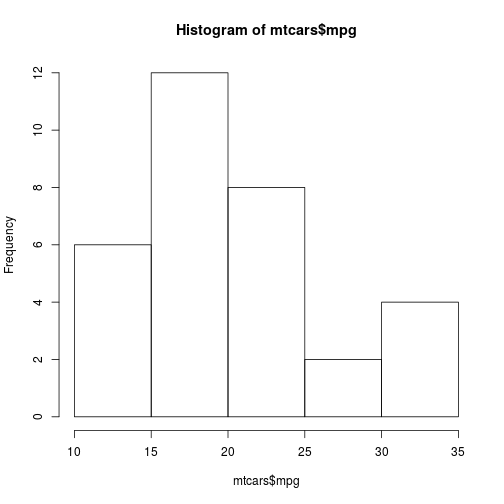

name: toc

```{r setup, include=FALSE}
options(htmltools.dir.version = FALSE)
```

```{r xaringanExtra, echo=FALSE}
library(xaringanExtra)
use_logo(
  image_url = "fig/ufpa.png",
  position = css_position(top = ".8em", right = "1em"),
  width = "140px",
  height = "140px"
)

use_extra_styles(
  hover_code_line = TRUE,         #<<
  mute_unhighlighted_code = TRUE  #<<
)

use_tachyons()
use_panelset()
use_clipboard()
style_panelset(panel_tab_color_active = "red")
```

```{r xaringanthemer, warning=FALSE, include=FALSE}
library(xaringanthemer)
style_mono_accent(
  base_color = "#43418A",
  header_font_google = google_font("Josefin Sans"),
  text_font_google   = google_font("Montserrat", "300", "300i"),
  code_font_google   = google_font("Fira Mono")
)
```

# Conteúdo

Parte 1
- [A linguagem R](#linguagemR)
- [Por que usar a linguagem R?](#porqueR)
- [RGui - Download e instalação](#RGui)
- [IDE Rstudio - download e instalação](#Rstudio)

Parte 2
- [Resampling](#resampling)
- [Inference](#inference)

---
name: linguagemR

# A linguagem R
## O que é?
### Um software estatístico livre

R é um ambiente de software livre de estatística e gráficos, capaz de compilar e executar em uma ampla variedade de plataformas UNIX, Windows e MacOS. Para fazer o download do R, é necessário escolher um **espelho CRAN** (https://cran.r-project.org/) para que seja feito o download da versão mais atual.

--

Os **espelho CRAN** são servidores distribuídos em diversos países que armazenam a linguagem R. Assim, ao deixar escolher de qual servidor será feito o download, permite-se que o usuário defina o servidor mais próximo, reduzindo tempo de tráfego.

---
name: porqueR

# Por que usar a linguagem R?

* Uma linguagem *open source* (código aberto).


.footnote[[🔙️](#toc)]

---
name: RGui

# RGui - Download e instalação

>- **1<sup>o</sup> Passo**: Acessar a página do projeto R em https://www.r-project.org/;

>- **2<sup>o</sup> Passo**: Do lado esquerdo da página clique sobre o link **CRAN**;

>- **3<sup>o</sup> Passo**: Será aberta uma página com diversos links de **CRAN Mirrors**, isto é, espelhos CRAN. Veja na tabela 1 os principais espelhos disponíveis no Brasil.

---
# O RGui

| ** Link **                          | ** Instituição**                                            |
| :---------------------------------- | :---------------------------------------------------------- |
| http://cran-r.c3sl.ufpr.br/         | Universidade Federal do Paraná (UFPR)                       |
| http://nbcgib.uesc.br/mirrors/cran/ | Center for Comp Biol at Universidade Estadual de Santa Cruz |
| https://cran.fiocruz.br/            | Oswaldo Cruz Foundation, Rio de Janeiro                     |
| http://cran.fiocruz.br/             | Oswaldo Cruz Foundation, Rio de Janeiro                     |
| https://vps.fmvz.usp.br/CRAN/       | University of São Paulo, São Paulo                          |
| http://brieger.esalq.usp.br/CRAN/   | University of São Paulo, Piracicaba|
Tabela 1: Espelhos CRAN disponíveis no Brasil.

---
# O RGui

**4<sup>o</sup> Passo**: Na página http://cran-r.c3sl.ufpr.br/, na seção **Download and Install R**, clicar em um dos três links, conforme o SO do usuário:

1. **Download R for Windows;**
2. **Download R for Linux; ou**
3. **Download R for (Mac) OS X.**

---
# O RGui

>- **5<sup>o</sup> Passo**: Clicar no link do **subdiretório base** ou em **install R for the first time**, para instalar o R pela primeira vez;

>- **6<sup>o</sup> Passo**: Clicar em **Download R 3.3.2 for Windows**. Assim, será iniciado o download do R Development Core Team para o respectivo sistema; e

>- **7<sup>o</sup> Passo**: Por fim, basta usar o setup baixado para instalar o programa.

---
# O RGui

Ao inicializar o **R Development Core Team** pela primeira vez aparecerá a seguinte imagem:

```{r, echo=FALSE, out.width='50%', fig.align='center', fig.cap='R Console'}
knitr::include_graphics('fig/Img1.png')
```

---
# O RGui

- No contato inicial do usuário com o RGui tem-se a visão do **R Console**.
- O sinal <font size="4" face="verdana" color="red"> > </font> é o prompt de comando.
- Execute as funções <font size="4" face="verdana" color="brown"> demo() </font>, <font size="4" face="verdana" color="brown"> help() </font>, <font size="4" face="verdana" color="brown"> help.start() </font>, <font size="4" face="verdana" color="brown"> q() </font>.

```{r, echo=FALSE, out.width='50%', fig.align='center', fig.cap='R Console'}
knitr::include_graphics('fig/Img1.png')
```

---
# O RGui

O RGui possui um **R editor**: **Arquivo** $\rightarrow$ **Abrir script**.

```{r, echo=FALSE, out.width='50%', fig.align='center', fig.cap='R editor'}
knitr::include_graphics('fig/Img2.png')
```

---
name: Rstudio

# IDE Rstudio - download e instalação

>- **1<sup>o</sup> Passo**: Acessar a página do projeto RStudio: https://www.rstudio.com;

>- **2<sup>o</sup> Passo**: Products $\rightarrow$ RStudio;

>- **3<sup>o</sup> Passo**: Selecionar a versão do RStudio para Desktop;

>- **4<sup>o</sup> Passo**: Na edição Open source $\rightarrow$ Download Rstudio Desktop;

>- **5<sup>o</sup> PASSO**: Installers for Supported Platforms $\rightarrow$ instalador RStudio; e

>- **6<sup>o</sup> Passo**: Por fim, basta usar o setup baixado para instalar o programa.

```{r, echo=FALSE, out.width='30%', fig.align='center', fig.cap=''}
knitr::include_graphics('fig/RStudio.png')
```

---
# Como citar o R? <span style='font-size:50px;'>&#129300;</span>

Use a função <font size="4" face="verdana" color="brown"> citation() </font> no prompt de comando. Para saber como citar o R-base pode-se simplesmente fazer:

.left-column[
```{r citeR, echo=TRUE, eval=FALSE}
citation()
```
]

.right-column[
```{r ref.label="citeR", highlight.output=c(4:6, 10:17), eval = TRUE, echo = FALSE, collapse=TRUE}
```
]

---
# Como citar pacotes do R? <span style='font-size:50px;'>&#129300;</span>

.left-column[
```{r citeGGplot2, echo=TRUE, eval=FALSE}
citation("ggplot2")
```
]

.right-column[
```{r ref.label="citeGGplot2", highlight.output=c(4:5, 9:16), eval = TRUE, echo = FALSE, collapse=TRUE}
```
]

---

# Iniciando no R
## Tipos de operadores

* Na linguagem R existe três tipos principais de operadores: 1) `aritméticos`; 2) `lógicos (ou booleanos)`; e 3) `comparação (ou relacionais)`. 

* Os operadores lógicos e relacionais operam com duas respostas possíveis: `TRUE` (verdadeiro) ou `FALSE` (falso).

<style type="text/css">
.tg  {border-collapse:collapse;border-color:#ccc;border-spacing:0;border-style:solid;border-width:1px;}
.tg td{background-color:#fff;border-color:#ccc;border-style:solid;border-width:0px;color:#333;
  font-family:Arial, sans-serif;font-size:14px;overflow:hidden;padding:10px 5px;word-break:normal;}
.tg th{background-color:#f0f0f0;border-color:#ccc;border-style:solid;border-width:0px;color:#333;
  font-family:Arial, sans-serif;font-size:14px;font-weight:normal;overflow:hidden;padding:10px 5px;word-break:normal;}
.tg .tg-wy0j{border-color:inherit;font-family:Arial, Helvetica, sans-serif !important;;font-size:14px;text-align:center;
  vertical-align:middle}
.tg .tg-baqh{text-align:center;vertical-align:top}
.tg .tg-thku{background-color:#f9f9f9;border-color:#000000;font-family:Arial, Helvetica, sans-serif !important;;font-size:16px;
  text-align:center;vertical-align:middle}
.tg .tg-95y4{border-color:inherit;font-family:Arial, Helvetica, sans-serif !important;;font-size:14px;font-weight:bold;
  text-align:center;vertical-align:middle}
.tg .tg-z67g{background-color:#f9f9f9;border-color:inherit;font-family:Arial, Helvetica, sans-serif !important;;font-size:14px;
  text-align:center;vertical-align:middle}
.tg .tg-0lax{text-align:left;vertical-align:top}
</style>
<table class="tg">
<thead>
  <tr>
    <th class="tg-95y4" colspan="2">Aritméticos</th>
    <th class="tg-95y4" colspan="2">Lógicos</th>
    <th class="tg-95y4" colspan="2">Relacionais</th>
  </tr>
</thead>
<tbody>
  <tr>
    <td class="tg-z67g">Adição</td>
    <td class="tg-z67g">+</td>
    <td class="tg-z67g">E (and)/para vetores</td>
    <td class="tg-z67g">&amp;</td>
    <td class="tg-z67g">Menor do que...</td>
    <td class="tg-z67g">&lt;</td>
  </tr>
  <tr>
    <td class="tg-wy0j">Subtração</td>
    <td class="tg-wy0j">-</td>
    <td class="tg-wy0j">E (and) </td>
    <td class="tg-wy0j">&amp;&amp;</td>
    <td class="tg-wy0j">Maior do que...</td>
    <td class="tg-wy0j">&gt;</td>
  </tr>
  <tr>
    <td class="tg-z67g">Multiplicação</td>
    <td class="tg-z67g">*</td>
    <td class="tg-z67g">Ou (or)/para vetores</td>
    <td class="tg-z67g">⎮</td>
    <td class="tg-z67g">Menor ou igual do que...</td>
    <td class="tg-z67g">&lt;=</td>
  </tr>
  <tr>
    <td class="tg-wy0j">Divisão</td>
    <td class="tg-wy0j">/</td>
    <td class="tg-wy0j">Ou (or)</td>
    <td class="tg-wy0j">⎮⎮</td>
    <td class="tg-wy0j">Maior ou igual do que...</td>
    <td class="tg-wy0j">&gt;=</td>
  </tr>
  <tr>
    <td class="tg-z67g">Potenciação</td>
    <td class="tg-z67g">^ ou **</td>
    <td class="tg-z67g">Não...</td>
    <td class="tg-z67g">!</td>
    <td class="tg-z67g">Igual a...</td>
    <td class="tg-thku">==</td>
  </tr>
  <tr>
    <td class="tg-wy0j">Resto da divisão</td>
    <td class="tg-wy0j">%%</td>
    <td class="tg-wy0j"></td>
    <td class="tg-wy0j"></td>
    <td class="tg-wy0j">Diferente de...</td>
    <td class="tg-wy0j">!=</td>
  </tr>
  <tr>
    <td class="tg-z67g">Parte inteira da divisão</td>
    <td class="tg-z67g">%/%</td>
    <td class="tg-z67g"></td>
    <td class="tg-z67g"></td>
    <td class="tg-z67g">Ou exclusivo...</td>
    <td class="tg-z67g">xor</td>
  </tr>
  <tr>
    <td class="tg-0lax"></td>
    <td class="tg-0lax"></td>
    <td class="tg-0lax"></td>
    <td class="tg-0lax"></td>
    <td class="tg-baqh">Contém</td>
    <td class="tg-0lax"><span style="font-weight:400;font-style:normal">%in%</span></td>
  </tr>
</tbody>
</table>

---
# Operadores aritméticos

.pull-left[
```{r refname, echo=TRUE, eval=FALSE}
2+3                    # adição
4*9                    # multiplicação
20/5                   # divisão
32-10                  # subtração
5^3                    # potenciação
10%%3                  # resto da divisão
10%/%3                 # Parte inteira da divisão
```

```{r refname2, echo=TRUE, eval=FALSE}
(2+3)*10
4*3**3

```

]

.pull-right[
```{r ref.label="refname", echo=FALSE, eval=TRUE, collapse=TRUE}
```

```{r ref.label="refname2", echo=FALSE, eval=TRUE, collapse=TRUE}
```

]

---
# Operadores relacionais (ou comparação)

.pull-left[
```{r logVar, echo=TRUE, eval=FALSE}
# criando variáveis "x", "y" e "v"
(x <- 20)
(y <- 10)
(v <- 1)

# criando dois vetores: "z" e "w"
(z <- c(1:5))
(w <- c(5:1))
```

```{r logname, echo=TRUE, eval=FALSE}
x > y        # x é maior do que y?
x < y        # x é menor do que y?
x != y       # x é diferente de y?
y <= x       # y é menor ou igual a x?
y >= x       # y é maior ou igual a x?
z >= w       # elementos de z são >= aos de w?
w >= z       # elementos de w são >= aos de z?
z == w       # elementos de z são iguais aos de w?
z != w       # elementos de z são dif. aos de w?
x >= w       # x é >= aos elementos de w?
w %in% v     # w contém v?
```
]

.pull-right[
```{r ref.label="logVar", echo=FALSE, eval=TRUE, collapse=T}
```
<br>
<br>

```{r ref.label="logname", echo=FALSE, eval=TRUE, collapse=T}
```

]

---
# Operadores lógicos


---
# Funções matemáticas usuais

A linguagem R dispõe de funções matemáticas usualmente encontradas em calculadoras científicas.

<style type="text/css">
.tg  {border-collapse:collapse;border-color:#ccc;border-spacing:0;border-style:solid;border-width:1px;}
.tg td{background-color:#fff;border-color:#ccc;border-style:solid;border-width:0px;color:#333;
  font-family:Arial, sans-serif;font-size:14px;overflow:hidden;padding:10px 5px;word-break:normal;}
.tg th{background-color:#f0f0f0;border-color:#ccc;border-style:solid;border-width:0px;color:#333;
  font-family:Arial, sans-serif;font-size:14px;font-weight:normal;overflow:hidden;padding:10px 5px;word-break:normal;}
.tg .tg-iog8{background-color:#f9f9f9;font-family:Arial, Helvetica, sans-serif !important;;font-size:20px;text-align:center;
  vertical-align:middle}
.tg .tg-f955{font-family:Arial, Helvetica, sans-serif !important;;font-size:20px;text-align:center;vertical-align:middle}
</style>
<table class="tg">
<thead>
  <tr>
    <th class="tg-f955"><span style="font-weight:bold">Função</span></th>
    <th class="tg-f955"><span style="font-weight:bold">Descrição</span></th>
  </tr>
</thead>
<tbody>
  <tr>
    <td class="tg-iog8">sqrt()</td>
    <td class="tg-iog8">Raiz quadrada</td>
  </tr>
  <tr>
    <td class="tg-f955">abs()</td>
    <td class="tg-f955">Valor absoluto</td>
  </tr>
  <tr>
    <td class="tg-iog8">sin(); cos(); tan()</td>
    <td class="tg-iog8">Funções trigonométricas</td>
  </tr>
  <tr>
    <td class="tg-f955">asin(); acos(); atan()</td>
    <td class="tg-f955">Funções trigonométricas inversas</td>
  </tr>
  <tr>
    <td class="tg-iog8">exp()</td>
    <td class="tg-iog8">Exponencial</td>
  </tr>
  <tr>
    <td class="tg-f955">log10()</td>
    <td class="tg-f955">Logarítmo na base 10</td>
  </tr>
  <tr>
    <td class="tg-iog8">log()</td>
    <td class="tg-iog8">Logarítmo natural</td>
  </tr>
  <tr>
    <td class="tg-f955">factorial</td>
    <td class="tg-f955">Fatorial</td>
  </tr>
</tbody>
</table>

---
# Alguns comandos básicos

| **Comando**                             | **Ação**                                      |
| :-------------------------------------: | :-------------------------------------------: |
| q()                                     | Fechar o programa                             |
| rm(nome do objeto)                      | Remover um objeto qualquer                    |
| ls()                                    | Listar os objetos na janela de trabalho atual |
| help(nome da função) ou ?nome da função | Solicitar ajuda sobre o uso de uma função     |
| save.image()                            | Salvar                                        |
| Ctrl + L                                | Limpar a tela do R console                    |
| history(max.show, nrow = 3)             | Listar os últimos 3 comandos executados       |
| getwd()                                 | Mostrar o diretório de trabalho               |
| setwd("diretório desejado")             | Mudar o diretório de trabalho                 |
| install.packages("nome do pacote")      | Instalar um pacote específico                 |
Tabela 3: Alguns comandos importantes no R.
---

# Alguns comandos básicos (cont.)

| **Comando**               | **Ação**                                       |
| :-----------------------: | :--------------------------------------------: |
| library("nome do pacote") | Carregar um pacote específico                  |
| dir()                     | Lista os arquivos existentes no diretório      |
| getOption("OutDec")       | Verificar o separador decimal definido         |
| options("OutDec=")        | Mudar o separador decimal para vírgula         |
| round(5.9845, digits=2)  | Função para arredondamento de casas decimais   |
| data()                    | Lista de data set disponíveis no R             |
| ?nomedodataset            | Obter informações detalhadas sobre um data set |
| class(nome do objeto)     | Verifica a classe de um objeto específico      |
| search()                  | Lista todos os pacotes carregados              |
Tabela 3: Alguns comandos importantes no R.
---

class: inverse, center, middle

# Estrutura de dados


---
.content-box-blue[test] yields


---

# Two-column Layout

.pull-left[
- One bullet.

- Another bullet.
]

.pull-right[
```{r, echo=FALSE, out.width='50%', fig.align='center', fig.cap='Logo'}

```
]

<!--
pagedown::chrome_print('https://deivisonsouza.github.io/R-Introduction/')
-->

---

.bg-washed-near-white.b--dark-green.ba.bw2.br3.shadow-5.ph4.mt5[
The only way to write good code is to write tons of bad code first. 
Feeling shame about bad code stops you from getting to good code

.tr[
— Hadley Wickham
]]

---
# Histograma

.panelset[
.panel[.panel-name[R Code]

```{r panel-chunk, fig.show='hide'}
hist(mtcars$mpg)
```
]

.panel[.panel-name[Plot]

```{r, echo=FALSE, out.width='40%', fig.align='center', fig.cap='', dpi=600}

```


]
]


---
