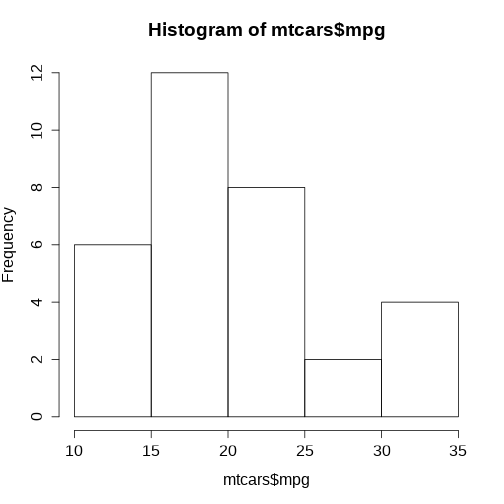

```{r setup, include=FALSE}
options(htmltools.dir.version = FALSE)
```


```{r xaringanExtra, echo=FALSE}
library(xaringanExtra)
use_logo(
  image_url = "fig/ufpa.png",
  position = css_position(top = ".8em", right = "1em"),
  width = "140px",
  height = "158px"
)

use_extra_styles(
  hover_code_line = TRUE,         #<<
  mute_unhighlighted_code = TRUE  #<<
)

use_tachyons()
use_panelset()
use_clipboard()
style_panelset(panel_tab_color_active = "red")
```

```{r xaringanthemer, warning=FALSE, include=FALSE}
library(xaringanthemer)
style_mono_accent(
  base_color = "#43418A",
  header_font_google = google_font("Josefin Sans"),
  text_font_google   = google_font("Montserrat", "300", "300i"),
  code_font_google   = google_font("Fira Mono")
)
```

# A linguagem R
## O que é?
### Um software estatístico livre

R é um ambiente de software livre de estatística e gráficos, capaz de compilar e executar em uma ampla variedade de plataformas UNIX, Windows e MacOS. Para fazer o download do R, é necessário escolher um **espelho CRAN** (https://cran.r-project.org/) para que seja feito o download da versão mais atual.

--

Os **espelho CRAN** são servidores distribuídos em diversos países que armazenam a linguagem R. Assim, ao deixar escolher de qual servidor será feito o download, permite-se que o usuário defina o servidor mais próximo, reduzindo tempo de tráfego.

---

# Por que usar a linguagem R?

* Uma linguagem *open source* (código aberto).

---

<!-- your comment 
class: center, inverse
background-image: url("ufpa.png")
-->

# O RGui
## <font size="6" face="verdana" color="#008000"> Processo de download e instalação </font> 
<br>

>- **1<sup>o</sup> Passo**: Acessar a página do projeto R em https://www.r-project.org/;

>- **2<sup>o</sup> Passo**: Do lado esquerdo da página clique sobre o link **CRAN**;

>- **3<sup>o</sup> Passo**: Será aberta uma página com diversos links de **CRAN Mirrors**, isto é, espelhos CRAN. Veja na tabela 1 os principais espelhos disponíveis no Brasil.

---
# O RGui
## <font size="6" face="verdana" color="#008000"> Processo de download e instalação </font> 
<br>


| ** Link **                          | ** Instituição**                                            |
| :---------------------------------- | :---------------------------------------------------------- |
| http://cran-r.c3sl.ufpr.br/         | Universidade Federal do Paraná (UFPR)                       |
| http://nbcgib.uesc.br/mirrors/cran/ | Center for Comp Biol at Universidade Estadual de Santa Cruz |
| https://cran.fiocruz.br/            | Oswaldo Cruz Foundation, Rio de Janeiro                     |
| http://cran.fiocruz.br/             | Oswaldo Cruz Foundation, Rio de Janeiro                     |
| https://vps.fmvz.usp.br/CRAN/       | University of São Paulo, São Paulo                          |
| http://brieger.esalq.usp.br/CRAN/   | University of São Paulo, Piracicaba|
Tabela 1: Espelhos CRAN disponíveis no Brasil.

---
# O RGui
## <font size="6" face="verdana" color="#008000"> Processo de download e instalação </font> 
<br>

**4<sup>o</sup> Passo**: Na página http://cran-r.c3sl.ufpr.br/, na seção **Download and Install R**, clicar em um dos três links, conforme o SO do usuário:

1. **Download R for Windows;**
2. **Download R for Linux; ou**
3. **Download R for (Mac) OS X.**

---
# O RGui
## <font size="6" face="verdana" color="#008000"> Processo de download e instalação </font> 
<br>

>- **5<sup>o</sup> Passo**: Clicar no link do **subdiretório base** ou em **install R for the first time**, para instalar o R pela primeira vez;

>- **6<sup>o</sup> Passo**: Clicar em **Download R 3.3.2 for Windows**. Assim, será iniciado o download do R Development Core Team para o respectivo sistema; e

>- **7<sup>o</sup> Passo**: Por fim, basta usar o setup baixado para instalar o programa.

---
# O RGui
## <font size="6" face="verdana" color="#008000"> Processo de download e instalação </font> 

Ao inicializar o **R Development Core Team** pela primeira vez aparecerá a seguinte imagem:

```{r, echo=FALSE, out.width='50%', fig.align='center', fig.cap='R Console'}
knitr::include_graphics('fig/Img1.png')
```

---
# O RGui

- No contato inicial do usuário com o RGui tem-se a visão do **R Console**.
- O sinal <font size="4" face="verdana" color="red"> > </font> é o prompt de comando.
- Execute as funções <font size="4" face="verdana" color="brown"> demo() </font>, <font size="4" face="verdana" color="brown"> help() </font>, <font size="4" face="verdana" color="brown"> help.start() </font>, <font size="4" face="verdana" color="brown"> q() </font>.

```{r, echo=FALSE, out.width='50%', fig.align='center', fig.cap='R Console'}
knitr::include_graphics('fig/Img1.png')
```

---

# O RGui

O RGui possui um **R editor**: **Arquivo** $\rightarrow$ **Abrir script**.

```{r, echo=FALSE, out.width='50%', fig.align='center', fig.cap='R editor'}
knitr::include_graphics('fig/Img2.png')
```

---

# O editor Rstudio
## <font size="6" face="verdana" color="#008000"> Processo de download e instalação </font> 
<br>

>- **1<sup>o</sup> Passo**: Acessar a página do projeto RStudio: https://www.rstudio.com;

>- **2<sup>o</sup> Passo**: Products $\rightarrow$ RStudio;

>- **3<sup>o</sup> Passo**: Selecionar a versão do RStudio para Desktop;

>- **4<sup>o</sup> Passo**: Na edição Open source $\rightarrow$ Download Rstudio Desktop;

>- **5<sup>o</sup> PASSO**: Installers for Supported Platforms $\rightarrow$ instalador RStudio; e

>- **6<sup>o</sup> Passo**: Por fim, basta usar o setup baixado para instalar o programa.

---
# Como citar o R?

Use a função <font size="4" face="verdana" color="brown"> citation() </font> no prompt de comando. Para saber como citar o R-base pode-se simplesmente fazer:

.left-column[
```{r citeR, echo=TRUE, eval=FALSE}
citation()
```
]

.right-column[
```{r ref.label="citeR", highlight.output=c(4:6, 10:17), eval = TRUE, echo = FALSE, collapse=TRUE}
```
]

---
# Como citar pacotes do R?

.left-column[
```{r citeGGplot2, echo=TRUE, eval=FALSE}
citation("ggplot2")
```
]

.right-column[
```{r ref.label="citeGGplot2", highlight.output=c(4:5, 9:16), eval = TRUE, echo = FALSE, collapse=TRUE}
```
]

---

# Iniciando no R
## Operações e operadores aritméticos

A linguagem R permite executar operações aritméticas básica (soma, subtração, multiplicação, divisão e potenciação).

**Operadores** |**Nome**                       |**Operações**
:-------------:|:-----------------------------:|:-------------:
+              | Somatório                     |2+3           
*              | Multiplicação                 |4*9
/              | Divisão                       |20/5
-              | Subtração                     |32-10
^ ou **        | Potenciação                   |5^3
%%             | Resto inteiro da divisão      |10%%3
%/%            | Parte inteira da divisão      |10%/%3
Tabela 2: Operações e operadores aritméticos.

---

# Operações e operadores aritméticos

.pull-left[
```{r refname, echo=TRUE, eval=FALSE}
2+3
4*9
20/5
32-10
5^3
10%%3
10%/%3
```
]

.pull-right[
```{r ref.label="refname", echo=FALSE, eval=TRUE, collapse=TRUE}
```
]

---
# Operadores lógicos

| **Operadores lógicos**  | **Descrição**                 |
| :---------------------: | :---------------------------: |
| <                       | Menor do que...               |
| >                       | Maior do que...               |
| <=                      | Menor ou igual do que...      |
| >=                      | Maior ou igual do que...      |
| ==                      | Igual a...                    |
| &                       | E (and)/para vetores          |
| &&                      | E (and)                       |
| &#x23ae;                | Ou (or)/para vetores          |
| &#x23ae;&#x23ae;        | Ou (or)                       |
| !=                      | Diferente de...               |
| !                       | Não...                        |
| is.na()                 | Valor numérico ou faltante... |

---
# Alguns comandos básicos

| **Comando**                             | **Ação**                                      |
| :-------------------------------------: | :-------------------------------------------: |
| q()                                     | Fechar o programa                             |
| rm(nome do objeto)                      | Remover um objeto qualquer                    |
| ls()                                    | Listar os objetos na janela de trabalho atual |
| help(nome da função) ou ?nome da função | Solicitar ajuda sobre o uso de uma função     |
| save.image()                            | Salvar                                        |
| Ctrl + L                                | Limpar a tela do R console                    |
| history(max.show, nrow = 3)             | Listar os últimos 3 comandos executados       |
| getwd()                                 | Mostrar o diretório de trabalho               |
| setwd("diretório desejado")             | Mudar o diretório de trabalho                 |
| install.packages("nome do pacote")      | Instalar um pacote específico                 |
Tabela 3: Alguns comandos importantes no R.
---

# Alguns comandos básicos (cont.)

| **Comando**               | **Ação**                                       |
| :-----------------------: | :--------------------------------------------: |
| library("nome do pacote") | Carregar um pacote específico                  |
| dir()                     | Lista os arquivos existentes no diretório      |
| getOption("OutDec")       | Verificar o separador decimal definido         |
| options("OutDec=")        | Mudar o separador decimal para vírgula         |
| round(5.9845, digits=2)  | Função para arredondamento de casas decimais   |
| data()                    | Lista de data set disponíveis no R             |
| ?nomedodataset            | Obter informações detalhadas sobre um data set |
| class(nome do objeto)     | Verifica a classe de um objeto específico      |
| search()                  | Lista todos os pacotes carregados              |
Tabela 3: Alguns comandos importantes no R.
---

class: inverse, center, middle

# Estrutura de dados


---
.content-box-blue[test] yields


---


?include_graphics
# Two-column Layout

.pull-left[
- One bullet.

- Another bullet.
]

.pull-right[

]

<!-- your comment
pagedown::chrome_print('https://deivisonsouza.github.io/R-Introduction/')
-->

---

.bg-washed-near-white.b--dark-green.ba.bw2.br3.shadow-5.ph4.mt5[
The only way to write good code is to write tons of bad code first. 
Feeling shame about bad code stops you from getting to good code

.tr[
— Hadley Wickham
]]

---
# Histograma

.panelset[
.panel[.panel-name[R Code]

```{r panel-chunk, fig.show='hide'}
hist(mtcars$mpg)
```
]

.panel[.panel-name[Plot]

```{r, echo=FALSE, out.width='40%', fig.align='center', fig.cap='', dpi=600}

```


]
]


---
